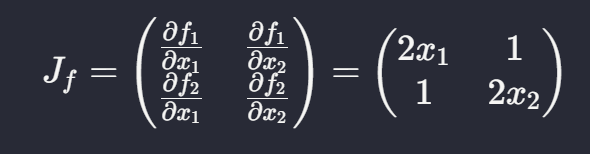
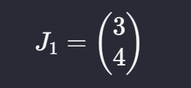
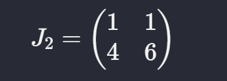
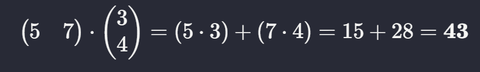

as example, we all already know about derivative

Single Variable Function: 
$f(x) = x^2$

Derivative = $\frac{dy}{dx} = 2x$ done.

But what about Multi-Variable Functions? For something like $f(x_1, x_2) = x_1^2 + 3x_1x_2 + x_2^2$, we use partial derivatives. These tell us how the function changes when we nudge one variable while keeping the other constant

we compute the partial derivative of f respect to x1 =
$\frac{df}{dx_1} = 2x_1 + 3x_2$

and separately the partial derivative to x2 =
$\frac{df}{dx_2} = 3x_1 + 2x_2$

# And now we talk about Jacobian Matrix
the case we facing right now is, what if we not only have 1 function with many variables, but what if we have multiple functions depending on multiple variables?

lets Imagine a function that takes a vector as an input and spits out another vector as an output

$$f(\mathbf{x}) = \begin{pmatrix} f_1(x_1, x_2) \\ f_2(x_1, x_2) \end{pmatrix} = \begin{pmatrix} x_1^2 + x_2 \\ x_1 + x_2^2 \end{pmatrix}$$

here yeah we know, vector $x_1$ dan $x_2$ as an input and output-ed the new vector of like the equation above. this show a 2 dimensional input into 2 dimensional output. Or elegantly, Jacobian Matrix will compute all possible derivatives in a multivariable multifunction system by organizing it into a systematis grid. from equation above, because of we do have 2 functions with 2 variables. we got exactly four partials derivative 

  

all we already know $\frac{\partial f_1}{\partial x_1}$ meant partial derivative from the first function respect to the first variable so the result will be the same position in the output-ed vector. and so on, and so on.

This four derivatives build a 2x2 matrix and this what we called "Jacobian Matrix" ($J_f$). Basically, the Jacobian contains all the info for a local linear approximation. It tells us exactly how the vector field behaves at any specific point.

## The Application (Computing Gradient Efficiently)
the use of this will shown, when we implemented it in neural-network training where the computational of the gradien become so important. 

we are gonna use simple neural network, where input $x$ and will one output $p$. and inside there will be hidden layer with neuron inside ofc. If we want to find the gradient of the output $p$ with respect to the input $x$ ($\frac{dp}{dx}$), we just chain these Jacobians together.

first step, we transform input $x$ into a hidden activatin vector. x -> $(a_1, a_2)$ 

$$J_1 = \begin{pmatrix} \frac{\partial a_1}{\partial_x} \\ \frac{\partial a_2}{\partial_x} \end{pmatrix}$$

then we transform the equation above (i guess), into another hidden layer with the activation of $b_1$ and $b_2$. $(a_1, a_2)$ => $(b_1, b_2)$

$$J_2 = \begin{pmatrix} \frac{\partial b_1}{\partial a_1} & \frac{\partial b_1}{\partial a_2} \\ \frac{\partial b_2}{\partial a_1} & \frac{\partial b_2}{\partial a_2} \end{pmatrix}$$

lastly, we combine it to get the output $p$, $(b_1, b_2)$ => $p$

$$J_3 = \begin{pmatrix} \frac{\partial p}{\partial b_1} \frac{\partial p}{\partial b_2} \end{pmatrix}$$

we can see, the size of the output vectors are different based on what size the input was.

first transformartion x -> $(a_1, a_2)$. Since it 2 outputs from 1 input, $J_1$ is a 2x1 matrix.

second transformation $(a_1, a_2)$ => $(b_1, b_2)$ (from first hidden layer to the second one). include 2 functions and 2 variables which so $J_2$ is a 2x2 matrix.

and last transformation $(b_1, b_2)$ => $p$ (from second hidden layer to output). This is 1 output from 2 inputs, so $J_3$ is a 1x2 matrix

### The important thing
To find the total sensitivity ($\frac{dp}{dx}$), we don't need to do crazy calculus all at once. We just multiply the matrices in order:

$$\frac{dp}{dx} = J_3 \cdot J_2 \cdot J_1$$

follow the standard $y = f(g(h(x)))$ logic

The dimensions even work out as good as it is: $(1 \times 2) \cdot (2 \times 2) \cdot (2 \times 1) = (1 \times 1)$. One single number that tells us how much $p$ changes if we tweak $x$."

# Contoh
assume we have a specific input and specific weights. We'll simplify the "functions" inside the neurons to be simple linear combinations (no non-linear activation for now, just to keep the math clean)

1. All we know
- Input: $x = 2$
- Layer A functions: $a_1 = 3x$, $a_2 = x^2$
- Layer B functions: $b_1 = a_1 + a_2$, $b_2 = a_1 \cdot a_2$
- Final Output: $p = b_1 + b_2$

2. The Forward Pass

Before we do the Jacobian, let's see what the actual numbers are at $x=2$:
- $a_1 = 3(2) = \mathbf{6}$
- $a_2 = (2)^2 = \mathbf{4}$
- $b_1 = 6 + 4 = \mathbf{10}$
- $b_2 = 6 \times 4 = \mathbf{24}$
- Output $p$ $= 10 + 24 = \mathbf{34}$

3. The Jacobians (The Derivatives)

let's find the sensitivity at each step using the numbers we just found.

Step 1: $J_1$ (Input to A)

$$\frac{\partial a_1}{\partial x} = 3, \quad \frac{\partial a_2}{\partial x} = 2x = 4$$

  

Step 2: $J_2$ (A to B)

$$\frac{\partial b_1}{\partial a_1} = 1, \quad \frac{\partial b_1}{\partial a_2} = 1$$

$$\frac{\partial b_2}{\partial a_1} = a_2 = 4, \quad \frac{\partial b_2}{\partial a_2} = a_1 = 6$$

  

Step 3: $J_3$ (B to Output $p$)

$$\frac{\partial p}{\partial b_1} = 1, \quad \frac{\partial p}{\partial b_2} = 1$$

$$J_3 = \begin{pmatrix} 1 & 1 \end{pmatrix}$$

4. Matrix Multiplication
To find out how much $p$ changes if we move $x$ slightly ($\frac{dp}{dx}$), we multiply them:

$$\frac{dp}{dx} = J_3 \cdot J_2 \cdot J_1$$

First, multiply $J_3 \cdot J_2$:

  

Then, multiply that result by $J_1$:

  

the point where $x=2$, the total sensitivity of the output to the input is 43. This means if we increase $x$ by a tiny amount (say, 0.01), the final output $p$ will increase by roughly $0.43$ (remember this process doesnt inlude activation like ReLu or Sigmoid). and by the way, if you still dont understand with the conlucsion above. thinking it of like 

while driving a car and the speedometer says 100 km/h right now, Does that mean you have traveled 100 km? ofc no. it just mean at this exact moment, if we kept this exact speed for one hour, we would travel 100 km. If we drive for just 1 minute (a tiny amount of time), we will just move a tiny distance, but that distance is still determined by our speed ($100 \times \text{time}$).

So...

When we calculated that the Jacobian result is 43 at $x=2$: The value 43 is not the "Speed." It’s how fast the output $p$ is growing compared to $x$ at that specific moment. The value $x=2$ is just "Where we are" on the map.

The "Linear Approximation" In calculus, the derivative $\frac{dp}{dx}$ tells us that for a very small change in $x$ (let's call it $\Delta x$), the change in $p$ ($\Delta p$) is roughly:

$$\Delta p \approx \frac{dp}{dx} \cdot \Delta x$$

So, using our numbers:
- Our "Speed" ($\frac{dp}{dx}$) = $43$
- Our "Tiny nudge" ($\Delta x$) = $0.01$
- The Resulting Change ($\Delta p$) = $43 \times 0.01 = 0.43$

