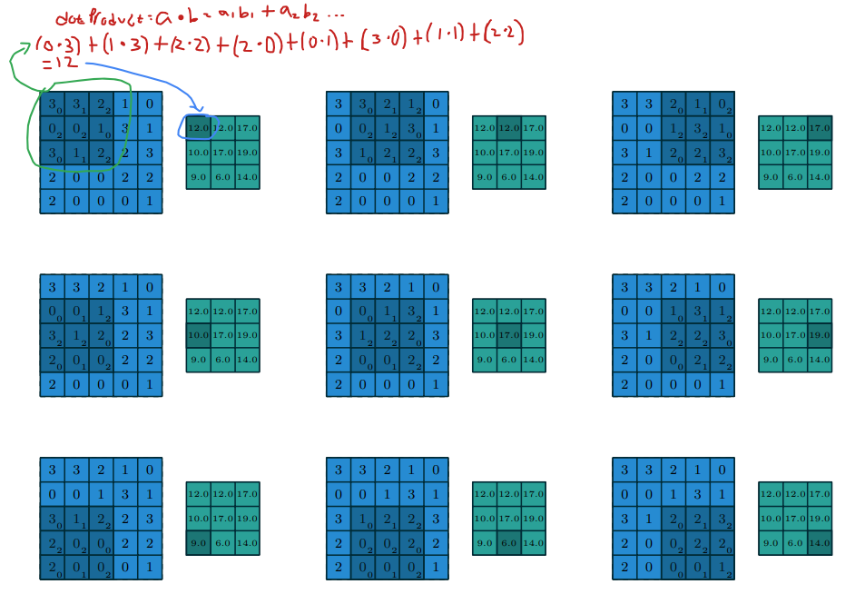
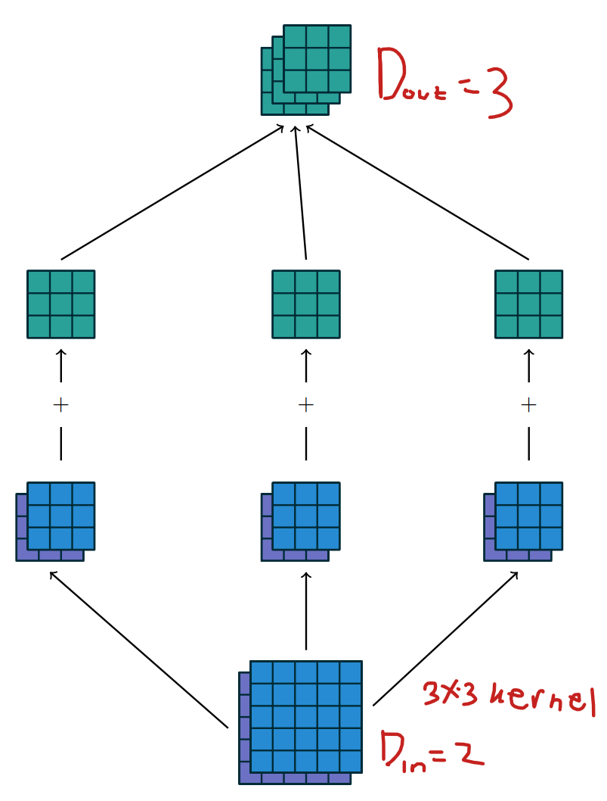
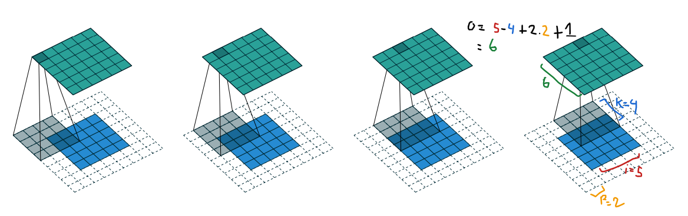
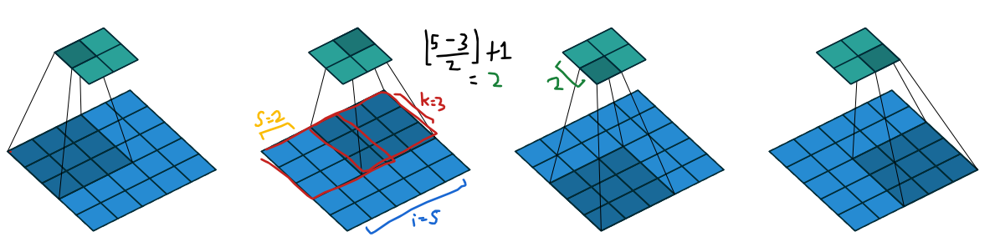

# Convolutional Neural Network (CNN)
CNN as it names "neural network" work like how human visual cortex systems works. and it used in deeplearning realm.  

jika di sebelumnya kita telah mengenal konsep image gradient vector, dan bagaimana algoritma HOG menyimpulkan informasi dari seluruh gradient vector dari sebuah gambar dll

disini kita membahas cnn classic untuk klasifikasi gambar. yang juga merupakan fondasi untuk nantinya ya 

well, kita akan membahas dulu keterbatasan transformasi afin (affine transformations) dalam jaringan saraf tradisional

Inti dari jaringan saraf adalah transformasi afine: sebuah vektor diterima sebagai input dan dikalikan dengan sebuah matriks untuk menghasilkan output (biasanya ditambahkan vektor bias sebelum hasilnya dilewatkan melalui fungsi nonlinier). Hal ini berlaku untuk segala jenis input, baik itu gambar, klip suara, maupun kumpulan fitur yang tidak terurut: apapun dimensinya, representasinya selalu bisa diratakan menjadi vektor sebelum dilakukan transformasi:

## Mekanisme
<ol>
<li>Input → Vektor Rata: Input apa pun (gambar, klip suara, fitur) harus diratakan (flattened) menjadi satu vektor (satu array 1-dimensi).

<li>Perkalian Matriks: Vektor input ini dikali dengan sebuah matriks (disebut weight matrix).

<li>Penambahan Bias: Hasil perkalian matriks ini ditambah dengan sebuah vektor bias.

<li>Nonlinieritas: Hasil akhir kemudian dilewatkan melalui fungsi nonlinier (seperti ReLU atau Sigmoid).
</ol>

Secara matematis, untuk input vektor x, matriks bobot W, dan vektor bias b, transformasinya adalah:

$$Output=f(Wx+b)$$

(di mana f adalah fungsi nonlinier).

## Masalah utamanya
Masalah-nya dengan Transformasi Afin ini adalah Mengabaikan Struktur Data. karena transformasi afin tidak memanfaatkan struktur intrinsik (bawaan) data terstruktur seperti gambar

| Properti           | Penjelasan                                                                 | Contoh                                                      |
|-------------------|---------------------------------------------------------------------------|------------------------------------------------------------|
| Array Multi-dimensi | Data disimpan dalam bentuk tensor dengan lebih dari satu dimensi.         | Gambar (Tinggi × Lebar × Channel)                         |
| Urutan Penting      | Urutan di sepanjang sumbu tertentu memiliki arti struktural.             | Sumbu lebar dan tinggi pada gambar; sumbu waktu pada klip suara. Mengubah urutan piksel secara acak akan merusak gambar. |
| Sumbu Channel       | Sumbu khusus untuk mengakses "pandangan" berbeda dari data yang sama.     | RGB (Merah, Hijau, Biru) pada gambar berwarna; Kiri/Kanan pada audio stereo. |

Intinya keterbatasannya adalah Ketika data terstruktur (misalnya, gambar 3D) diratakan menjadi vektor 1D. 

**Informasi Topologi Hilang** Hubungan spasial (kedekatan) antara piksel yang berdekatan dalam gambar rusak

**Diperlakukan Sama** dimana semua sumbu (lebar, tinggi, channel) diperlakukan sama setelah diratakan. Jaringan saraf tidak tahu bahwa dua elemen yang berdekatan di vektor mungkin sebenarnya jauh di gambar asli, atau sebaliknya.

ya pada akhirnya **Struktur Tidak Dieksploitasi** Sifat penting seperti urutan dan channel diabaikan.

## Solusi
Sebagai solusinya **discrete convolution** berperan untuk mempertahankan struktur intrinsik data (dimensi spasial dan urutan) dan memanfaatkannya saat memproses data.

## 1.1 Discrete convolutions

Cara penerapan dari Konvolusi diskrit adalah sebagai blok bangunan utama dalam Convolutional Neural Networks (CNNs), yang sangat efektif dalam tugas-tugas yang melibatkan data terstruktur seperti visi komputer dan pengenalan ucapan.

Akhirnya, Dengan menggunakan konvolusi, jaringan dapat belajar pola lokal dan fitur spasial (misalnya, garis tepi atau sudut) dengan menerapkan kernel (filter) kecil yang bergerak melintasi dimensi spasial, sehingga menghormati topologi data.

## sifat utama konvdisk
Konvolusi diskrit adalah jenis transformasi linier yang dirancang untuk melestarikan konsep urutan (atau topologi) data. dengan dua sifat mendasar yang membuatnya sangat efisien dan efektif

### Sparsitas (Konektivitas Lokal)
Berbeda dengan transformasi afine di mana setiap unit input terhubung ke setiap unit output (*fully connected*), konvolusi bersifat *sparse connected*. Artinya, hanya sebagian kecil unit input yang berdekatan yang berkontribusi pada perhitungan satu unit output.

Jika divisualisasikan, setiap piksel output hanya dipengaruhi oleh sekelompok piksel lokal di sekitar posisi yang sama pada gambar input. Hal ini memanfaatkan fakta bahwa informasi yang paling relevan untuk suatu piksel biasanya ada di sekitarnya.

### Parameter Sharing
Konvolusi menggunakan kembali bobot yang sama (disebut *kernel* atau *filter*) di berbagai lokasi input yang berbeda. Bayangkan seperti menggunakan kaca pembesar yang sama untuk mencari pola tertentu (misalnya garis tepi horizontal) di setiap area gambar.

Sifat ini sangat mengurangi jumlah parameter yang harus dipelajari oleh model, sehingga jauh lebih efisien dibandingkan lapisan afine penuh, yang harus mempelajari bobot unik untuk setiap koneksi.

wujud asli dari kernel, matriks bobot kecil yang disebut filter. Kernel inilah yang digeser (slide) ke seluruh peta fitur input untuk melakukan operasi perkalian dan penjumlahan, menghasilkan satu titik pada peta fitur output.

Kernel (atau filter) bergerak melintasi peta fitur input (input feature map). Pada setiap posisi, dilakukan perhitungan hasil kali antara setiap elemen kernel dengan elemen input yang tumpang tindih, kemudian hasil-hasil tersebut dijumlahkan untuk menghasilkan output pada posisi saat ini.
Prosedur ini dapat diulangi dengan menggunakan berbagai kernel yang berbeda untuk membentuk sebanyak mungkin peta fitur output (output feature maps) yang diinginkan (lihat Gambar 1.3).
Hasil akhir dari prosedur ini disebut output feature maps.

Jika terdapat beberapa peta fitur input, maka kernel harus memiliki dimensi tiga (3D) — atau secara ekuivalen, setiap peta fitur input dikonvolusikan dengan kernel yang berbeda — dan hasil dari tiap konvolusi tersebut dijumlahkan secara elemen demi elemen (elementwise) untuk menghasilkan satu peta fitur output.

Konvolusi yang digambarkan pada Gambar sebelumnya adalah contoh dari konvolusi dua dimensi (2D convolution), namun konsepnya dapat digeneralisasi menjadi konvolusi N-dimensi (N-D convolution).
Sebagai contoh, dalam konvolusi 3D, kernel berbentuk kubus (cuboid) dan bergerak melintasi tinggi (height), lebar (width), serta kedalaman (depth) dari peta fitur input.

Kumpulan kernel yang mendefinisikan konvolusi diskrit memiliki bentuk (shape) yang sesuai dengan suatu permutasi dari $(n, m, k_1, \ldots, k_N)$, di mana:

1. $n$ = jumlah *output feature maps*

Setiap *layer konvolusi* menghasilkan sejumlah *feature map* baru — sesuai dengan berapa banyak *kernel/filter* yang kita gunakan.

Misalnya, kita menggunakan **32 filter**: maka layer tersebut menghasilkan **32 output feature maps**, jadi $n = 32$

2. $m$ = jumlah *input feature maps*  

Bayangkan kita memasukkan gambar RGB ke dalam CNN.  
Gambar RGB memiliki 3 *channel*: **R** (Red), **G** (Green), **B** (Blue)

Artinya jumlah *input feature map* adalah 3 (karena ada 3 *channel*). Jadi $m = 3$

Jika lapisan sebelumnya menghasilkan 16 *feature maps*, maka: $m = 16$

3. $k_j$ = ukuran kernel sepanjang sumbu ke-$j$

$o_j$ yang digunakan untuk menentukan ukuran tiap feature map (tinggi × lebar). Dimana beberapa properti berikut memengaruhi ukuran output $o_j$ dari suatu lapisan konvolusi di sepanjang sumbu ke-$j$:

$$
o_j = \left\lfloor \frac{i_j + 2p_j - k_j}{s_j} \right\rfloor + 1
$$

- $o_j$ : ukuran *output* sepanjang sumbu ke-$j$ 
- $i_j$ : ukuran *input* sepanjang sumbu ke-$j$  
- $k_j$ : ukuran *kernel* sepanjang sumbu ke-$j$  
- $s_j$ : *stride* (jarak antara dua posisi kernel yang berurutan) di sepanjang sumbu ke-$j$  
- $p_j$ : *zero padding* (jumlah nol yang ditambahkan di awal dan akhir suatu sumbu) di sepanjang sumbu ke-$j$

Sebagai contoh, Gambar 1.2 menunjukkan sebuah kernel 3 × 3 yang diterapkan pada input 5 × 5 dengan padding nol 1 × 1 dan stride 2 × 2.

Perlu diperhatikan bahwa stride merupakan salah satu bentuk subsampling.
Sebagai alternatif dari menganggapnya sebagai ukuran seberapa jauh kernel digeser, stride juga dapat dipandang sebagai ukuran seberapa banyak output yang dipertahankan.

gambar ini menunjukkan bagaimana satu set filter (kernel) bekerja pada peta fitur input, menghasilkan peta fitur output

Sebuah proses konvolusi memetakan dua *input feature maps* menjadi tiga *output feature maps* menggunakan kumpulan kernel $w$ berukuran $3 \times 2 \times 3 \times 3$. Pada jalur kiri, *input feature map* pertama dikonvolusikan dengan kernel $w_{1,1}$ dan *input feature map* kedua dengan kernel $w_{1,2}$. Hasil dari kedua konvolusi tersebut dijumlahkan secara elemen demi elemen (*elementwise*) untuk membentuk *output feature map* pertama. Prosedur yang sama diulang untuk jalur tengah dan jalur kanan guna membentuk *output feature map* kedua dan ketiga, yang kemudian dikelompokkan bersama (*stacked*) untuk menghasilkan output akhir.

Contohnya gini biar lebih jelas:

Perlu dicatat bahwa stride merupakan bentuk dari subsampling.
Sebagai alternatif dari melihat stride sebagai ukuran seberapa jauh kernel bergeser, stride juga dapat dianggap sebagai ukuran seberapa banyak bagian output yang dipertahankan.

Sebagai contoh, menggeser kernel dengan lompatan dua (stride = 2) setara dengan menggeser kernel dengan lompatan satu (stride = 1) tetapi hanya mempertahankan elemen output bernomor ganjil (lihat Gambar 1.4).

### 1.2 Pooling
Selain konvolusi diskrit itu sendiri, operasi pooling merupakan komponen penting lainnya dalam CNN (Convolutional Neural Networks).
Pooling berfungsi untuk mengurangi ukuran peta fitur (feature maps) dengan menggunakan suatu fungsi untuk merangkum subregion (wilayah kecil), misalnya dengan mengambil nilai rata-rata (average pooling) atau nilai maksimum (max pooling).

Pooling bekerja dengan cara menggeser sebuah jendela (window) di atas input, lalu mengumpankan isi jendela tersebut ke fungsi pooling.  
Dalam beberapa hal, mekanisme pooling mirip dengan konvolusi diskrit, namun menggantikan kombinasi linear (dot product) yang dilakukan kernel dengan fungsi lain (seperti maksimum atau rata-rata).

Gambar berikutnya bakalan menunjukkan contoh average pooling, abis itu bakal menunjukkan max pooling.

Ini average pooling

Ini Max pooling

## 2. Aritmetika Konvolusi (Convolution Arithmetic)
Analisis hubungan antara berbagai properti lapisan konvolusi menjadi lebih mudah karena setiap sumbu (axis) bekerja secara independen — artinya, pemilihan ukuran kernel, stride, dan zero padding pada sumbu ke-$j$ hanya memengaruhi ukuran output pada sumbu tersebut, dan tidak berinteraksi dengan sumbu lain.

### 2.1 Tanpa Zero Padding, dengan Stride = 1
Kasus paling sederhana untuk dianalisis adalah ketika **kernel** melintasi setiap posisi input tanpa *padding* dan tanpa lompatan, yaitu ketika $s = 1$ dan $p = 0$. Gambar 2.1 menunjukkan contohnya untuk $i = 4$ dan $k = 3$. Salah satu cara untuk menentukan **ukuran output** dalam kasus ini adalah dengan menghitung jumlah posisi yang mungkin bagi kernel di atas input, misalnya pada sumbu lebar (*width*).

Kernel mulai dari sisi paling kiri input, lalu bergeser satu langkah demi satu langkah hingga menyentuh sisi kanan. Ukuran output sama dengan jumlah langkah yang dilakukan ditambah satu — karena posisi awal kernel juga dihitung (lihat Gambar 2.8a). Logika yang sama berlaku untuk sumbu tinggi (*height*).  

Secara formal, hubungan berikut dapat diturunkan:  

**Hubungan 1**  
Untuk sembarang $i$ dan $k$, serta $s = 1$ dan $p = 0$:  

$$
o = (i - k) + 1
$$

### 2.2 Zero Padding, dengan Stride = 1

Untuk memperhitungkan *zero padding* (dengan tetap membatasi $s = 1$), mari kita lihat efeknya terhadap ukuran *input* efektif:  
Padding sebesar $p$ di setiap sisi akan mengubah ukuran input efektif dari $i$ menjadi $i + 2p$.

Dalam kasus umum, Hubungan 1 dapat digunakan kembali untuk menurunkan hubungan berikut:

**Hubungan 2**  
Untuk sembarang $i, k, p$, dan $s = 1$:

$$
o = (i - k) + 2p + 1
$$

Gambar 2.2 menunjukkan contoh untuk $i = 5$, $k = 4$, dan $p = 2$.

Dalam praktiknya, terdapat dua jenis *zero padding* yang sering digunakan karena sifatnya yang berguna. Mari kita bahas keduanya.

---

#### 2.2.1 Half (Same) Padding

Kadang kita menginginkan agar ukuran *output* sama dengan ukuran *input* (yaitu $o = i$).  
Kondisi ini bisa dicapai dengan memilih *padding* yang sesuai.

**Hubungan 3**  
Untuk sembarang $i$, dan jika $k$ adalah bilangan ganjil ($k = 2n + 1$, $n \in \mathbb{N}$),  
dengan $s = 1$ dan $p = \lfloor k / 2 \rfloor = n$, maka:

$$
o = i + 2\lfloor k/2 \rfloor - (k - 1) = i + 2n - 2n = i
$$

Kondisi ini disebut **half padding** atau **same padding** (*padding setengah* atau *padding sama*).  
padding.png)
Gambar 2.3 menunjukkan contohnya untuk $i = 5$, $k = 3$, dan karenanya $p = 1$.

---

#### 2.2.2 Full Padding

Secara umum, konvolusi dengan kernel akan mengurangi ukuran *output* dibandingkan ukuran *input*.  
Namun, dalam beberapa kasus, justru diperlukan *output* yang lebih besar dari *input*.  
Hal ini dapat dicapai dengan menambahkan *zero padding* yang cukup besar.

**Hubungan 4**  
Untuk sembarang $i$ dan $k$, dengan $p = k - 1$ dan $s = 1$:

$$
o = i + 2(k - 1) - (k - 1) = i + (k - 1)
$$

Biasanya, konvolusi membuat output lebih kecil dari input, karena kernel tidak bisa lewat di luar batas gambar.
Tapi dengan full padding, kita tambahkan nol di sekeliling input agar kernel bisa meliputi semua kemungkinan posisi, termasuk yang hanya menyentuh sebagian area input.

**Intuisi:**

| Jenis Padding | Rumus Output | Efek |
|----------------|---------------|-------|
| Tanpa padding | $o = i - k + 1$ | Output mengecil |
| Half / Same padding | $o = i$ | Output sama |
| Full padding | $o = i + k - 1$ | Output membesar |

### 2.3 No zero padding, non-unit strides
Kasus:

$p$ = 0 (tidak ber-padding) dan $s$ > 1 (stride lebih dari 1)

Stride > 1 artinya kernel melompat beberapa piksel sekaligus saat bergerak.
Jadi, tidak semua posisi input dikunjungi oleh kernel → hasilnya output jadi lebih kecil.

**Hubungan 5**

$$
o = \left\lfloor \frac{i - k}{s} \right\rfloor + 1
$$

Kenapa kita memakai floor (pembulatan kebawah)? 
Karena kadang kernel tidak pas berhenti di ujung input. Kalau stride-nya besar, sisa beberapa piksel di ujung bisa tidak ter-cover.

### 2.4 Zero padding, non-unit strides
Kasus:

$p$ > 0 dan $s$ > 1 (stride lebih dari 1)

hubungan 5 sudah menangani stride > 1 tetapi tanpa padding, kalau kita ingin menambahkan padding, kita tinggal mengganti ukuran input efektif dari $i$ menjadi $i + 2_p$. Ini adalah trik  yang sama persis dilakukan waktu dari hubungan 1 → hubungan 2 (waktu stride = 1)

**Hubungan 6**
$$
o = \left\lfloor \frac{i + 2p - k}{s} \right\rfloor + 1
$$

Akan tetapi penggunaan fungsi floor dalam rumus dimensi output konvolusi, dan ini hanya berlaku untuk non-unit strides ($s > 1$). Ini merupakan inti dari Ambiguitas Dimensi Output dalam operasi konvolusi pada hubungan 6

Lihat kan, ukuran input yang berbeda menghasilkan hasil konvolusinya menjadi ukuran output yang sama

intinya Fungsi floor yang pada dasarnya adalah pembulatan ke bawah. Ia membuang sisa atau pecahan dari hasil pembagian. misalnya nilai awal (pembilang) berbeda ($4$ dan $5$), setelah dibagi 2 dan dibulatkan ke bawah, hasilnya sama (2).

## Chapter 3 Pooling arithmetic

Dalam jaringan saraf, lapisan pooling memberikan invariansi terhadap pergeseran kecil (small translations) pada input. Pooling yang paling sering digunakan adalah max pooling, yaitu, Membagi input menjadi beberapa patch kecil (biasanya tidak saling tumpang tindih / non-overlapping), lalu Mengambil nilai maksimum dari setiap patch untuk menjadi output.

Atau Mean pooling atau average pooling, yang mengambil rata-rata nilai dari patch, bukan maksimum. Intinya Semua jenis pooling ini punya prinsip dasar yang sama, Menggabungkan (meng-aggregate) nilai lokal dari sebagian kecil area input dengan fungsi non-linear tertentu.

semua hubungan matematis (relationship) yang diturunkan untuk konvolusi di bab sebelumnya juga berlaku untuk pooling — kecuali:

Pooling tidak menggunakan zero padding, jadi rumusnya lebih sederhana.

$$
o = \left\lfloor \frac{i - k}{s} \right\rfloor + 1
$$

## Chapter 4 Transposed Convolution Arithmetic

Kita butuh Transposed convolution (kadang disebut deconvolution)  karena kita ingin melakukan operasi kebalikan dari konvolusi biasa. bukan secara matematis “inverse”, tapi secara spasial membalik arah transformasi.

# Belom kelar
