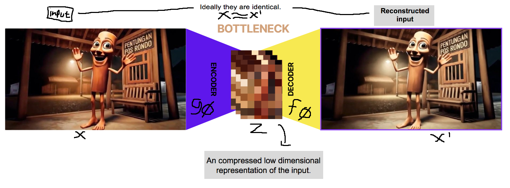
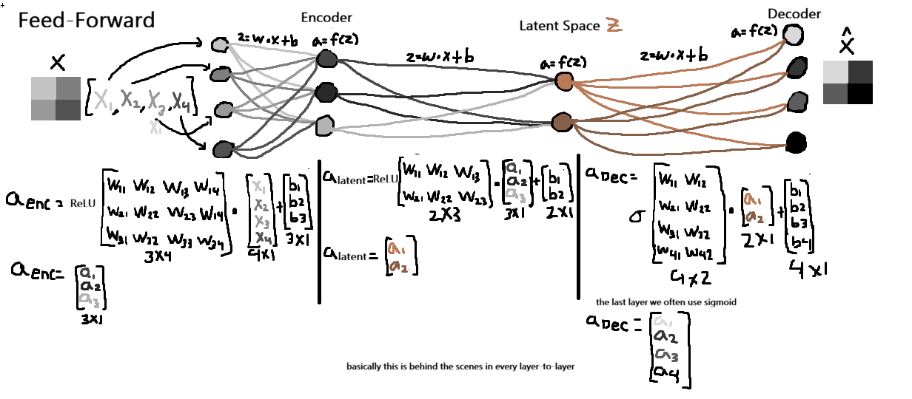
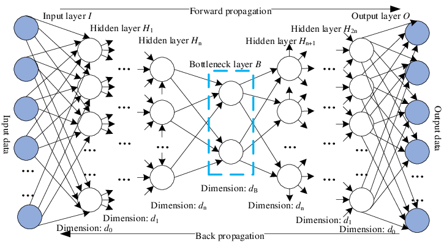
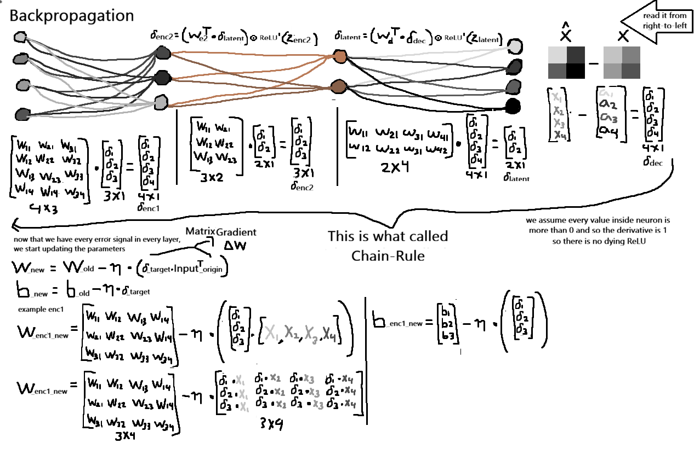

# AutoEncoder

## What is that?
before we talk the math. lets first understand what an AutoEncoder actually is. as the name already states, the idea is to automatically encode the data. so, the model have a purpose to compress high dimensional data (remember image basically a giant matrix) into a smaller set of features. you can think of this process like explaining a panda to someone who has never seen one, at first you might describe many details like it is a mammal, it have a weight of certain amount of kg, have a round ear, it has black and white fur, have a round body, and so on. and this just a lot of explaination, at the end we can "summarize" it by just saying 2 key features "having a black and white fur and having a round body". not really a good explaination/representation to be honest, because our poor friend can mistaken a zebra with panda. but at least it this short description still captures the most important information and allows them to reconstruct the imagination about what is a panda

this is exactly what an Autoencoder does, Its architecture consists of 3 main components. **the encoder** (we trying to tell what is panda), **latent space / Bottleneck** (a very short explaination about panda), and **the decoder** (our dear friend trying to reconstruct the panda). okay that was fun, but lets forget about panda for now. okay, the encoder have a task to compress the input data (for our task, the input data is an image) into a latent space representation. a latent space is a low-dimensional space that should/must captures the essentional/importance features. and the decoder, it task is to reconstruct the input data from the latent space (the compressed representation)

And something important to remember is unlike generative models such as Variational AutoEncoders (VAE) or GANs, a vanilla AutoEncoder does not model the underlying data distribution explicitly. Therefore, sampling random points from its latent space does not guarantee meaningful or realistic outputs.

## How we train this network
the main purpose of this network is to be able to reconstruct a new image ($\hat{x}$) from input data ($x$), so the target just basically $x \approx \hat{x}$.. lets split the discussion into three parts. And btw I use fully connected (FC). 

## HOLD ON A SEC
before we push any further, i just want to explain that because of i used Hinton's paper as one of the reference, the explanation below uses symmetrical network, and this is not a strict rule. In fact, many studies and real-world applications show that asymmetric AutoEncoders can perform equally well or even better, depending on the task and constraints. 

1. Encoder-heavy, Decoder-light

This design is useful when the encoder is the main component used after training, for example in feature extraction or representation learning on resource-limited devices such as mobile phones. During training, a powerful server can handle the heavy encoder, while the decoder is kept relatively simple since it is only needed to compute the reconstruction loss.

2. Decoder-heavy, Encoder-light

This configuration is often found in generative-related models, where the latent representation is intentionally kept compact, but the decoder is made deeper or more expressive to reconstruct high-resolution or highly detailed outputs. In this case, the decoder plays a more dominant role in shaping the final output.

lets head back to the main topic

### The Encoder
okay, dont imagining it will be using a hard math. how this part can squeeze the size from the input? the encoder basically just reduce the use of neuron by every layer. so if you read the paper (by Hinton and Salakhutdinov, 2006) titled "Reducing the Dimensionality of Data with Neural Networks" as you see from the title itself, "Neural Networks" and also you gonna see they use term of "The autoencoder consisted of an encoder with layers of size $(28 \times 28) \rightarrow 400 \rightarrow 100 \rightarrow 6$ and a symmetric decoder". this mean, the image size is 28x28 (so, 784 features) connected to 400 neuron in first layer, then the 400 neurons connected to 200 neurons and so on, all the way to 6 neurons. mathematically for 1 layer

$$h = \sigma(W_e \cdot x + b_e)$$

this for neuron not layer, because $h$ means an output vector (containing all output scalar in this layer). $W_e$ is an encoder's weight matrix and $\sigma$ is an activation function (like ReLu) 

to illustrate the operations in each layer, we will focus on the decoder part, as the encoder applies the same underlying process 

### The BottleNeck (The Latent Space)
and then, what happens to the last 6 features? they form the latent space. and it contains a vector $1 x\times n$ where $n$ depends on the number of neurons in the final encoder layer and it dont have to be 2 (e.g. because we have 6 neurons it will form in a vector $z \in \mathbb{R}^6$ so $z = [z_1, z_2, z_3, z_4, z_5, z_6]$ with 6 elements). and This vector contains compressed information that captures the most relevant features of the input. After sufficient training, samples with similar structures often tend to be close to each other in the latent space, although this behavior is not explicitly enforced in a standard autoencoder

### The Decoder 
Decoder, the opposite of encoder. it purpose is just to reconstruct image just with information from the latent space. so it expand the vector contains 6 value back into 784 value

our main target to make the reconstruction $\hat{x}$ more similar to input $x$. how does it really works? okay, back to the Hilton's paper, because of symmetrical architecture if the encoder $784 \rightarrow 400 \rightarrow 100 \rightarrow 6$, so the decoder would be $6 \rightarrow 100 \rightarrow 400 \rightarrow 784$. and we use <a href="LinearTransformation.md">Linear Transformation"</a> followed by activation.

as an example, from latent space ($z$, contain 1x6 vector) into first decoder's layer (100 neuron). first 6 value from the vector in latent space we multipy with a different weights (remember the backboned is not CNN but FC) to get new 100 number, so weight's matrix ($W_{d1}$) have a size of 100x6 (100 from first layer of decoder and 6 from latent space). so for the first layer it will form 

$$h_{d1} = \text{ReLU}(W_{d1} \cdot z + b_{d1})$$

for the second layer (100 neurons to 400 neurons)

$$h_{d2} = \text{ReLU}(W_{d2} \cdot h_{d1} + b_{d2})$$

et cetera

the logic behind this process is, 6 value inside the vector acts like a coordinate. even though we cant make a raw interpretation but let say the first scalar represent the top curve, second scalar represent the the bottom line and so on. you got the idea, and so the weights $W_d$ have to "translate" the coordinat, into more complex pixels pattern. and after going layer after layer, the Decoder reach the last layer with 784 neuron (like the input 28x28). this part have some special with the activation function, because we have to consider the normalize we used in the image. and let say we use MNIST dataset, because this only consist black and white (and between) colours. MNIST often got normalize to the range of 0 until 1. so by this reason alone, we use the Sigmoid activation

$$\hat{x} = \sigma(W_{final} \cdot h_{prev} + b_{final})$$

Sigmoid make every neurons in last layer represents the light intencity of one pixel. so if the output neuron in index 10 is 0.95, it means pixel in index 10 has to be a very bright white. and if the neuron in index 50 is 0.05, it means pixel in index 50 have to be dark. and thats it. ... Well of course the first training it will just construct a random noise. thats why a process called "Backpropagation" will help us fix thats problem. by having the loss, for this problem because of we use MNIST, we can compute by comparing every pixel from the real image into the reconstruction image, will result in a scalar that reprsent the loss. and again we compute the gradien and lastly we updated the weights. for more details, lets discuss it

### Backpropagation

Even though this network consists of three main parts, only the **encoder** and **decoder** contain trainable parameters, while the **latent space** is a parameter-free representation. Backpropagation starts from the reconstruction loss at the decoder and propagates backward through the latent space to update the encoder.

In this case, we compare images pixel by pixel. We assume that all pixel values are normalized into the range \([0, 1]\), where 0 represents black and 1 represents white. Therefore, we use **Binary Cross Entropy (BCE)** as the loss function:

$$
L = -[x \log(\hat{x}) + (1 - x) \log(1 - \hat{x})]
$$

If we use <a href="BCExSigmoid.md">BCE with Sigmoid as the activation function</a>, the final derivative simplifies to:

$$
\hat{x} - x
$$

This happens due to a phenomenon called **cancelling out**, where identical terms appear in both the numerator and denominator, allowing them to simplify to 1 and be removed. In neural networks, we are not only interested in the derivative with respect to the output $\hat{x}$, but also with respect to the **logit** ($z$), which is the value before being processed by the activation function (sigmoid).

---

### Layer Output to Decoder (Layer 784 to 100)

Now, we begin the backward journey (error relay). Our first error is the vector $\delta_{output}$ of size $784 \times 1$:

$$
\delta_{output} = \hat{x} - x
$$

To propagate the error to the decoder’s 400-unit layer, we pass it through the decoder weights $W_{dec3}$.

To make this clearer, consider a simple network where we use a single input feature, compress it into a 1D latent space, and then reconstruct it.

$$
\text{Raw Error}_{dec400} = W_{dec2}^T \cdot \delta_{output}
$$

Remember the post-activation step. Since the 400-unit layer uses ReLU, we filter the error using its activation status during the forward pass:

$$
\delta_{dec400} = \text{Raw Error}_{dec400} \odot \text{ReLU}'(z_{dec400})
$$

(Remember: $\text{ReLU}' = 1$ if $z > 0$, and $0$ if $z \le 0$.)

---

### Crossing the Latent Space  
Now the error is at the 100-unit decoder layer.

We propagate it further into the latent space:

$$
\delta_{latent} = (W_{dec1}^T \cdot \delta_{dec100}) \odot \text{Activation}'(z_{latent})
$$

Although the latent space has no internal weights, it acts as a bridge. This error signal $\delta_{latent}$, with size $6 \times 1$, becomes the starting point for the encoder to update its parameters.

---

### From Latent to Encoder (Layer 100 to 784)

The process repeats recursively. The encoder receives the error signal from the latent space.

To the 400-unit encoder layer:

$$
\delta_{enc400} = (W_{enc2}^T \cdot \delta_{latent}) \odot \text{ReLU}'(z_{enc400})
$$

To the input layer: In principle, we could compute $\delta_{input}$, but since the input $x$ is fixed data and cannot be updated, the backpropagation process stops at updating the encoder weights $W_{enc1}$.

---

### Parameter Update (Gradient Descent)

After obtaining the error signals ($\delta$) for each layer, we perform parameter updates following the principle of **Stochastic Gradient Descent (SGD)**.

1. **Weight Update ($W$)**  
Each weight matrix is updated by multiplying the error signal of the target layer with the input from the source layer:

$$
W_{new} = W_{old} - \eta \cdot (\delta_{target} \cdot \text{Input}_{source}^T)
$$

Example: For $W_{dec2}$, the source input is the activation from the 400-unit layer.

2. **Bias Update ($b$)**  
Bias updates are simpler; each bias is reduced by the error signal of its corresponding neuron:

$$
b_{new} = b_{old} - \eta \cdot \delta_{target}
$$

