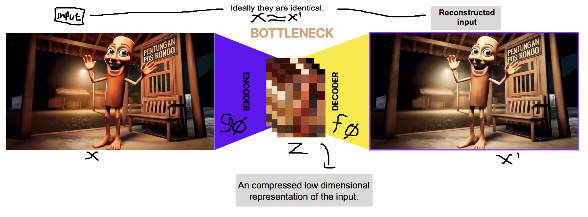

# Auto Encoder
why we need this? Sebelum muncul AE, ada dua masalah besar di dunia unsupervised learning dan dimensionality reduction yaitu Banyak data (contohnya gambar) punya ratusan hingga ribuan fitur. contoh klasiknya adalah dataset gambar MNIST yang ukurannya 28x28 piksel punya 784 dimensi. Kalau kita kompresi, harus ada cara yang optimal tanpa membuat banyak informasi penting hilang. 

Kita bisa menggunakan PCA, tapi masalahnya PCA hanya bisa menangkap hubungan linear antar fitur.
Padahal dunia nyata umumnya non-linear. misalnya "tung tung tung sahoor" PCA mungkin bisa nangkep perbedaan “cerah vs gelap” atau “besar vs kecil”, tapi gak bisa memahami ekspresi wajah (senyum, marah, dsb) atau pentungan-nya atau pencahayaannya atau yang lain lain

## Thats why
Autoencoder diciptakan untuk merekonstruksi data berdimensi tinggi menggunakan model jaringan saraf yang memiliki lapisan sempit (bottleneck) di tengah.

Efek samping yang menarik dari proses ini adalah reduksi dimensi — karena lapisan bottleneck akan menangkap representasi laten yang terkompresi.
Representasi berdimensi rendah ini dapat digunakan sebagai embedding vector untuk berbagai aplikasi (misalnya sistem pencarian), membantu kompresi data, atau mengungkap faktor penyebab di balik data (data generative factors).

## Notation

| Symbol | Mean |
| :--- | :--- |
| $\mathcal{D}$ | The dataset, $\mathcal{D} = \{ \mathbf{x}^{(1)}, \mathbf{x}^{(2)}, \ldots, \mathbf{x}^{(n)} \}$, contains $n$ data samples; $|\mathcal{D}| = n$. |
| $\mathbf{x}^{(i)}$ | Each data point is a vector of $d$ dimensions, $\mathbf{x}^{(i)} = [x_1^{(i)}, x_2^{(i)}, \ldots, x_d^{(i)}]$. |
| $\mathbf{x}$ | One data sample from the dataset, $\mathbf{x} \in \mathcal{D}$. |
| $\mathbf{x}'$ | The reconstructed version of $\mathbf{x}$. |
| $\tilde{\mathbf{x}}$ | The corrupted version of $\mathbf{x}$. |
| $\mathbf{z}$ | The compressed code learned in the bottleneck layer. |
| $a_j^{(l)}$ | The activation function for the $j$-th neuron in the $l$-th hidden layer. |
| $g_{\phi}(\cdot)$ | The **encoding** function parameterized by $\phi$. |
| $f_{\theta}(\cdot)$ | The **decoding** function parameterized by $\theta$. |
| $q_{\phi}(\mathbf{z}|\mathbf{x})$ | Estimated posterior probability function, also known as **probabilistic encoder**. |
| $p_{\theta}(\mathbf{x}|\mathbf{z})$ | Likelihood of generating true data sample given the latent code, also known as **probabilistic decoder**. |

Encoder: $g_{\phi}$ → kompres data

Decoder: $f_{\theta}$ → kembalikan data

Untuk model probabilistik (seperti VAE), kita pakai notasi $q$ dan $p$ karena modelnya mempelajari distribusi, bukan hanya titik nilai.

Autoencoder adalah jaringan saraf yang dirancang untuk mempelajari fungsi identitas secara unsupervised, yaitu tanpa label, dengan tujuan merekonstruksi input asli sambil mengompres data agar diperoleh representasi yang lebih efisien.
Gagasan ini muncul sejak tahun 1980-an, dan kemudian populer berkat makalah penting dari Hinton & Salakhutdinov (2006).

Autoencoder terdiri dari dua jaringan, Dimana
1. Encoder network: Mengubah input berdimensi tinggi menjadi kode laten berdimensi rendah.
Ukuran input > ukuran output.
2. Decoder network: Merekonstruksi kembali data dari kode laten tersebut, biasanya dengan lapisan yang semakin besar menuju output akhir.

Encoder menghasilkan kode laten:
$\mathbf{z} = g_{\phi}(\mathbf{x})$

Decoder menghasilkan rekonstruksi:
$\mathbf{x}' = f_{\theta}(\mathbf{z}) = f_{\theta}(g_{\phi}(\mathbf{x}))$

Tujuan pembelajaran adalah:
$\mathbf{x}' \approx \mathbf{x}$
Artinya, model ingin output mirip input — dengan cara menekan loss rekonstruksi.

Ada berbagai metrik untuk mengukur perbedaan antara dua vektor (input dan output).

Jika output menggunakan aktivasi sigmoid, bisa pakai cross entropy loss.

Jika tidak, biasanya cukup Mean Squared Error (MSE):

$$
LAE(\theta, \phi) = \sum_{i=1}^{n} \left( x^{(i)} - f_\theta \big( g_\phi(x^{(i)}) \big) \right)^2
$$