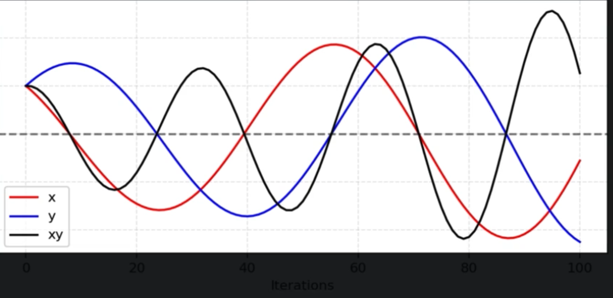

# Generative Adversarial Networks (GAN): Sebuah Tinjauan Profesional

## Abstrak

**Generative Adversarial Network (GAN)** merupakan sebuah kelas *model generatif* dalam *machine learning* yang diperkenalkan oleh **Ian Goodfellow** dan rekan-rekannya pada tahun 2014.  
Arsitektur ini secara inovatif menggunakan dua jaringan saraf yang dilatih secara simultan dalam sebuah skema permainan *zero-sum*.  

- **Generator (G)** bertugas menghasilkan data.  
- **Discriminator (D)** bertugas mengevaluasi keaslian data tersebut.  

Tujuan akhirnya adalah melatih *Generator* hingga mampu menghasilkan data artifisial yang tidak dapat dibedakan dari data asli.

---

## 1. Analogi Intuitif: Pemalsu vs. Ahli Forensik

Untuk memahami konsep GAN secara intuitif, bayangkan sebuah permainan antara dua pihak:

- **Generator (Si Pemalsu)**: Seorang pemalsu yang sangat berbakat yang mencoba membuat karya seni palsu (misalnya, lukisan *Monalisa* palsu). Tujuannya adalah membuat karya yang begitu sempurna sehingga tidak ada yang bisa membedakannya dari yang asli.

Generator adalah jaringan yang akan mengambil input berupa noise acak (z) dan mengubahnya menjadi data palsu/sintetis yang realistis dengan tujuannya yaitu adalah untuk menipu discriminator, enerator belajar dari kesalahan dengan backpropagation, sehingga lama-kelamaan bisa menghasilkan data palsu yang sangat mirip data asli.

- **Discriminator (Si Ahli Forensik)**: Seorang ahli seni dan forensik yang bertugas memeriksa setiap karya seni dan menentukan apakah itu asli atau palsu.

Bisa dilihat kalau tugas utama si discriminator, mengecilkan probabilitas gambar palsu sebagai gambar asli. meskipun gambar (fake) semakin mirip dengan gambar aslinya 

Prosesnya berjalan sebagai berikut:

1. Pada awalnya, si pemalsu (`G`) menghasilkan lukisan yang buruk. Ahli forensik (`D`) dengan mudah mengidentifikasinya sebagai palsu.  
2. Ahli forensik (`D`) terus belajar dari karya asli dan karya palsu yang ia lihat, membuatnya semakin pintar dalam mendeteksi ketidaksempurnaan sekecil apa pun.  
3. Si pemalsu (`G`), berdasarkan umpan balik dari kegagalannya menipu si ahli, terus mengasah kemampuannya untuk menghasilkan karya yang lebih baik.  
4. Siklus ini berlanjut hingga si pemalsu menjadi begitu mahir sehingga si ahli forensik tidak lagi yakin dan peluangnya menebak dengan benar hanya 50%. Pada titik ini, si pemalsu telah berhasil menciptakan karya palsu yang sempurna.

---

## 2. Arsitektur dan Komponen

GAN terdiri dari dua model jaringan saraf:

### **Generator (`G`)**

- **Input**: Sebuah vektor acak (*random noise*) $z$ dari *latent space*.  
- **Proses**: `G` merupakan jaringan *deconvolutional* yang memetakan vektor $z$ menjadi data berdimensi sama dengan data asli (misalnya gambar). Hasilnya adalah $G(z)$ — data sintetis.  
- **Tujuan**: Menghasilkan $G(z)$ sedemikian rupa sehingga $D(G(z)) \approx 1$, artinya berhasil menipu *Discriminator*.

### **Discriminator (`D`)**

- **Input**: Data yang bisa berasal dari dataset asli ($x$) atau hasil dari *Generator* ($G(z)$).  
- **Proses**: `D` adalah jaringan *convolutional* (klasifikator biner) yang menghasilkan sebuah nilai probabilitas tunggal, $D(x)$, yang merepresentasikan kemungkinan bahwa $x$ adalah data asli.  
- **Tujuan**: Memberikan $D(x) \to 1$ untuk data asli dan $D(G(z)) \to 0$ untuk data palsu.

---

## 3. Formulasi Matematis: *The Minimax Game*

Inti dari GAN dijelaskan dalam sebuah **fungsi tujuan (objective function)** yang merepresentasikan permainan *minimax* antara `G` dan `D`.

Fungsi nilainya, $V(D, G)$, didefinisikan sebagai:

$$
\min_G \max_D V(D, G) = \mathbb{E}_{x \sim p_{data}(x)}[\log D(x)] + \mathbb{E}_{z \sim p_z(z)}[\log(1 - D(G(z)))]
$$

### Penjelasan Notasi:

- **$\min_G \max_D$**  
  Notasi *minimax*:  
  - *Discriminator* (`D`) mencoba **memaksimalkan** fungsi ini.  
  - *Generator* (`G`) mencoba **meminimalkannya**.

- **$\mathbb{E}_{x \sim p_{data}(x)}[\log D(x)]$**  
  - $x$ adalah sampel dari distribusi data asli.  
  - $D(x)$ adalah probabilitas yang diberikan oleh `D` bahwa $x$ adalah data asli.  
  - Tujuan `D`: membuat $D(x) \to 1$ untuk data asli (karena $\log(1) = 0$ adalah nilai maksimum logaritma).

- **$\mathbb{E}_{z \sim p_z(z)}[\log(1 - D(G(z)))]$**  
  - $z$ adalah sampel *noise* acak.  
  - $G(z)$ adalah data palsu yang dihasilkan oleh `G`.  
  - $D(G(z))$ adalah probabilitas bahwa `D` menganggap data palsu tersebut asli.  
  - Tujuan `D`: membuat $D(G(z)) \to 0$.  
  - Tujuan `G`: membuat $D(G(z)) \to 1$ (menipu `D`), sehingga berusaha **meminimalkan** bagian ini.

---

Secara ringkas, `D` dan `G` memainkan permainan *zero-sum* pada fungsi $V(D, G)$.  
Pelatihan mencapai **Nash Equilibrium** ketika `G` menghasilkan data dengan distribusi yang identik dengan data asli, dan `D` tidak dapat membedakannya — yaitu ketika:

$$
D(x) = 0.5 \quad \text{untuk semua } x
$$

Mengapa tidak kita hitung per piksel? 

Karena GAN ditujukan untuk membuat data baru, bukan mereplikasi data, di sini jika hasil data satu-banding-satu antara latih dengan hasil, hal itu berarti GAN justru belajar untuk membuat data yang sudah ada, yang diinginkan dari permainan min-max adalah sebuah fungsi yang dapat mengemulasikan distribusi data (i.e., distribusi data sama, tetapi tidak sama secara individu sampel datanya sendiri).

### Apa yang menyebabkan ketidakstabilan dalam pelatihan GAN?

#### Sulit mencapai Nash Equilibrium

GAN melibatkan dua model  (generator dan discriminator) yang berinteraksi dalam bntuk permainan dua pemain yang tidak mau bekerjasama. Keduanya memperbarui parameternya masing-masing secara bersamaan dan independen yang mana membuat proses pelatihan mengalami osilasi dan seringkali tidak konvergen.

Ketika kedua model melakukan pembaruan dengan arah yang saling bertolak belakang, seperti pada contoh gambar di atas, hasilnya adalah perubahan parameter yang saling menarik satu sama lain, menciptakan osilasi ekstrem yang semakin memburuk seiring waktu.

#### low dimensional supports
Distribusi data nyata (Pr) dan distribusi data buatan dari generator (Pg) biasanya berada pada manifold berdimensi rendah dalam ruang dimensi tinggi. Ini membuat keduanya tidak tumpang tindih, sehingga discriminator dapat dengan mudah membedakan antara data nyata dan palsu, yang menghambat pembelajaran generator

Manifold dengan dimensi yang kecil akan lebih mudah untuk tidak membuat overlap saat berada di  ruangan berdimensi tinggi

#### Mode Collapse
Mode collapse terjadi ketika generator menghasilkan output yang sangat mirip atau bahkan identik, meskipun menerima input noise yang berbeda. Dalam situasi ini, generator hanya berhasil mengecoh discriminator dengan satu atau sedikit jenis output, lalu terus-menerus menghasilkan jenis output itu saja.

Penyebab:
Tidak ada insentif yang cukup bagi generator untuk mengeksplorasi variasi data lainnya karena discriminator terlalu mudah dikecoh dengan satu jenis output tertentu.

Ketika manifold Pg dan Pr tidak tumpang tindih, generator tidak mendapatkan feedback pembelajaran yang baik, sehingga terjebak pada solusi lokal.

### mengubah loss function atau arsitektur GAN untuk memperbaiki hasil pelatihan

Untuk memperbaiki hasil pelatihan GAN, kita bisa menggunakan [Wasserstein GAN (WGAN)](../3.%20GAN/WGAN.md)  yang menggunakan Earth Mover's Distance sebagai loss function:

misalnya kita ada dua tumpukan tanah (Satu mewakili distribusi data asli dan Satu lagi mewakili distribusi data hasil generator), Earth Mover’s Distance mengukur “biaya minimum” untuk memindahkan tanah dari satu tumpukan agar bentuknya menjadi sama dengan tumpukan lainnya. Sehingga, Semakin kecil jaraknya, semakin mirip dua distribusi tersebut.

#### Lipschitz Continuity dan Stabilitas Training
Agar Earth Mover’s Distance bisa dihitung dan tetap stabil,
fungsi discriminator (yang pada WGAN disebut critic) harus Lipschitz continuous —
artinya, gradiennya tidak boleh terlalu besar (dibatasi dalam suatu range tertentu). 

Untuk menjamin hal ini, ada dua pendekatan utama:

1. **Weight Clipping**
Setelah setiap pembaruan bobot, semua bobot “dipotong” (clipped) agar tetap berada dalam rentang tertentu, misalnya [-0.01, 0.01]. Ini memastikan bahwa fungsi tetap “halus” dan gradien tidak meledak. Namun, terlalu keras melakukan clipping bisa membuat jaringan sulit belajar.

2. **Gradient Penalty (WGAN-GP)**
Pendekatan yang lebih efektif. karena alih-alih kita potong bobot-nya, kita tambahkan penalti pada loss jika gradien dari critic terlalu jauh dari nilai ideal (biasanya 1). Dengan demikian, critic tetap Lipschitz continuous tanpa menghambat kemampuan belajar.

$$
L = L_{\text{WGAN}} + \lambda \left( \| \nabla_{\hat{x}} D(\hat{x}) \|_2 - 1 \right)^2
$$

