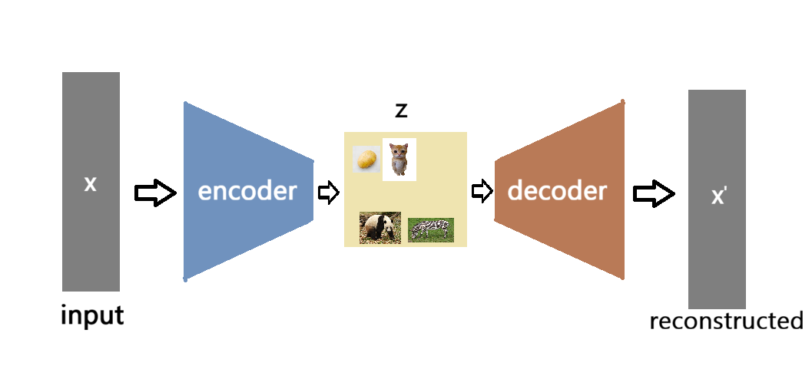
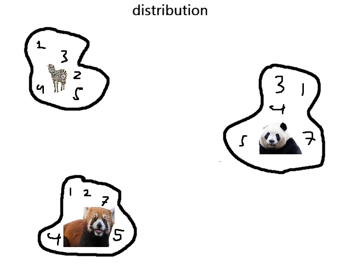
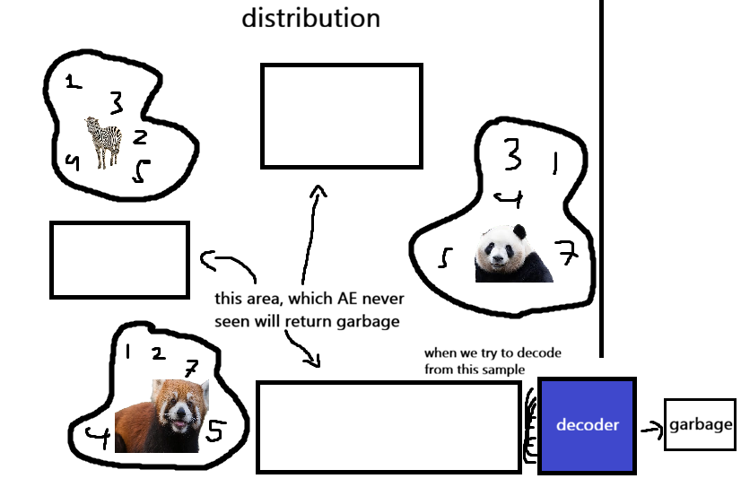
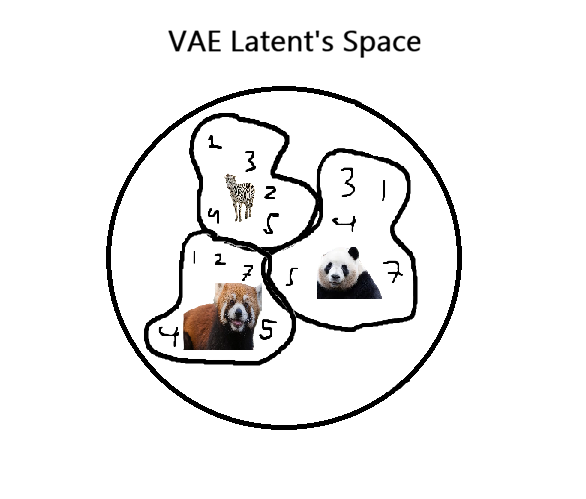
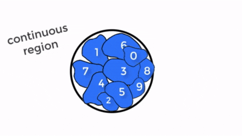
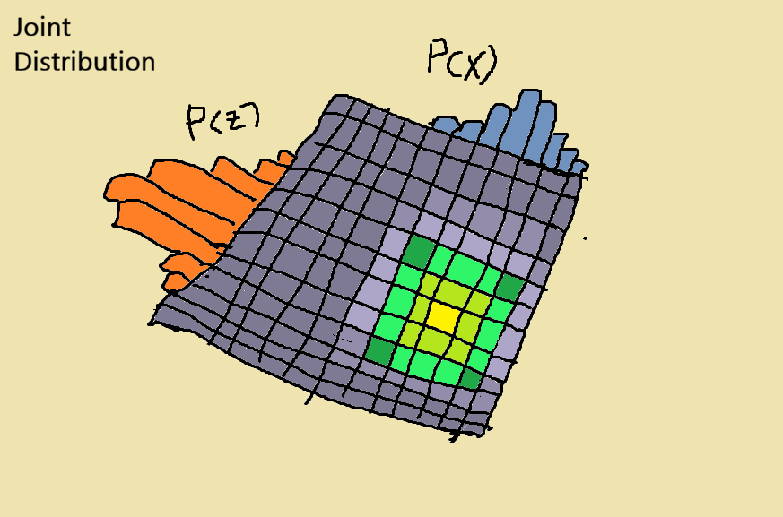

# Variational Autoencoder (VAE)
Hi, now we talk about a network which now the Autoencoder are consider "generative", this time we focus with the latent space (the $z$ part if you remember), instead we rely with encoder to compress the data and decoder to uncompress it, now we sampling the latent space. so here we go

## The Problem
Autoencoder also have the latent space, but again it all just a layer with small amount of neurons, targeting to get information as dense as possible. the problem with this (which if iam not mistaken, i did tell it in the discussion about <a href="AutoEncoder.md">Autoencoder (AE)</a>) is even that an Autoencoder can compress data into a latent space and reconstruct it back.
However, this latent space is deterministic: each input is mapped to a single point. at the end, even if clusters for each class appear, there is no guarantee that nearby latent points correspond to semantically similar data, this means the network doesnt get any semantic meaning for each class. 

The solutions is, now we try to make the latent space to represents the parameters of a (multivariate) distribution, make it so the cat (animal) and the potato (vegetable) having a less similar representation. and because now each class have a semantic relationship in the latent space, we want to be able to sample from the latent space to generate a new data, so no more reconstruct input but we generate a new one (thats why AE is not consider generative but VAE is) 

But, why AE cant generate new data? we have some problem if we only using AE, before we jumps into it, lets recap about what AE actually does:

1. training phase: basically contain of encoder-latent-decoder. we train how model can effectively encode the image into vector

2. testing phase: now we remove the encoder part, leaving only latent-decoder. now the main problem with this, is when we throw a random vector it would likely return a garbage  

again, why this happened? its all because we trying to "sampling from a distribution". what is that?

### Distribution 
distribution, means a bunch or pool of numbers/vectors, in this case the pool consists of vectors that represent images such as a dog, a cat, a giraffe etc. the encoder basically the one responsible to creates every pool for every label 

These distributions learned by AE when doing the training phase 

### Sampling 
so what is sampling? sampling is basically we took a random number from something. in this case, when we pick a random vector from a panda's pool, this could happen only if we know the location of panda's pool ofc. So when people say "I sample from the distribution of red panda's images" basically it means "we picked a random vector from red panda's pool". but again, remember this could only happens if we know where are these pools located (the ilustration above is just an illustration. becasue how you visualise a high dimensional). thats the problem with general AE.

But during test time, we have to sampling from a random distribution, and because AE can literally put a value distribution anywhere it want. there will be many empty spaces. and when we sampling it (we bring a random vector to decode it, AE never seen such vector)

So, what if we know where to pick vectors to generate image that look atleast similar to what we have expect? thats when VAE enter the game

## VAE
before we jump into the math, i would like to explain it in a way, so you guys can connect the dots later.

Ok, so instead of letting model to put pools in whatever place it wants. why dont we first define a constrained region. so the gap for each pool are not that far anymore. and when we sampling from area of panda and zebra, we will have an image that atleast still looks good and makes sense

And these pools are continuos, you guys probably already heard that and maybe still wonder what with continuous? continuous means the vector is not just a list of whole numbers like 1, 2, or 3. It filled with decimals like 1.0001 or 1.0000002.  and since there is an infinite number of points between any two coordinates, the model cant just "jump" from one data point to another. It has to learn the entire "terrain" in between. Thats the reason why we can sample a point anywhere and still get something that looks like a real image instead of just random static

from one of many video which i used as preference <a href="https://www.youtube.com/watch?v=fcvYpzHmhvA">CodeEmporium </a> 

## Concepts
Ok, now before we talk about the math, lets first we learn the context behind of it 

### PDF (Probability Density Function)

imagine we have a variable $X$ consist of value between zero to ten so $X \in [0, 10]$, when something occurs according to the probability distribution of $X$ thats what we called "sampling from X" wrote as $x \sim X$  (this means $x$ is a random number we got by sampling the mountain data of $X$)

after sampling, we got $p(x)$ this is what we called as probability density function of $x$, dont make it seems hard to understand. it basically just shows us every probability of a value from $X$ (between 1 to 10) beinge sampled by $x$ (and this continuos not discrete, so we have decimal and thats why my visualisation below have a bar more than 10)

### Expectation 

theres a important equation that can represent the distribution of $X$, we often wrote it as $\mathbb{E}(X)$, we read it as "Expectation of X". and what is that really is? expectation of $X$ is the way how we know its center point and thats just the average value $X$. to make it simple, imagine in a class of 30 people with different height. Expectation ($\mathbb{E}(X)$) is just a mean of height from that class. 

to compute the expectation we cant use $\Sigma$, because it discreate means we cant compute the small number. and thats why we use integral:

$$\mathbb{E}(X) = \int x \cdot p(x) dx$$

again, dont make it hard to understand. $x$ is just the value (i.e a dice consist 1,2,3 ... 6), $p(x)$ is just the probability (like in a dice the probability is 1/6 for every $x$) and lastly for $\int$ literally just said "sum every part of it and dont forget with the small number" (basically like Sigma, but for continuous). 

why is this important? because let say we close our eyes and randomly sampling a kid from that one class we already measure for their height, its random of course we dont know exactly what that one student's height that you gonna pick. But, the most reasonable value we expect to get is the mean (and thats why it called "expect") 

### Joint Distribution

Ok, now say we have 2 ranom variables ($x$ and $z$), now we have what we called the joint distribution

as you guys can see, that shows us the probability of each possible pair of events occuring together. each variables has its own marginal distribution, marginal distribution is just what we get when we focus on only one variable. we notate the joint distribution as p(x, z) meaning the probability of $x$ and $z$ happening at the same time. and marginal distribution just p(x) and p(z) they got separated  

what makes joint distribution so important? its because from the joint distribution we can use it to compute each of the marginal distributions, with the process called "marginalisation", its the process to integrate the joint distribution with respect to the other variable. 

To get $p(x)$ (the probability of sampling a specific $x$), we perform an integration over all possible values of $z$. We’re basically 'summing out' the $z$ to see the bigger picture of $x$

$p(x) = \int p(x, z) dz$

and it also works the other way around too. if we want $p(z)$, all we have to do is just integrate the joint distribution over all values of $x$

$p(z) = \int p(x, z) dx$

### Conditional probabilities
when we talk about joint distribution, it means we look at every possibility. but conditional probabilities, a scenario, its just what the probabilites of something to be happend when we have other conditions occured. term you might always hear is "p of x given z" or notated as $p(x|z)$. and this can be compute with

$$p(x|z) = \frac{p(x, z)}{p(z)}$$

**remember about what we already discuss above**, because as you can see it is expressed using the joint distribution and the marginal distribution of z. the joint distribution ($p(x, z)$) is like the whole mountain of data. When we want to find $p(x|z)$, it means we slice that mountain at a specific condition $z$. but that tiny slice does not have a total area of 1 yet. To make it a proper probability distribution, we need to normalize it. We do this by dividing the slice by the probability of $z$ occurring ($p(z)$). This 'stretches' the slice so that its total probability equals 1.

so when we said z equals to 3, we simply slice only where z equals to 3 and normalize its values by dividing it by the probability of $z$ being 3 ($p(z=3)$)

## VAE
Now we understand the basic concepts, but we face a major problem. In VAE, we have the image data ($x$) and the latent code ($z$), which exist in two different spaces. To understand how our model sees the data, we need to find the Marginal Likelihood $p(x)$. As discussed, this requires us to look at every possible $z$ that could have generated that image:

$$p(x) = \int p(x|z) p(z) dz$$

Here, $p(z)$ is our Prior (the simple Gaussian "mountain" we define), and $p(x|z)$ is the Likelihood (what the Decoder produces). To calculate $p(x)$, the computer must integrate the Decoder's results for every single possible value of $z$ in the entire latent space.

heres the problems:

1. The Infinite Search (Curse of Dimensionality)

Imagine we encode an image of a dog into a 20-dimensional latent space. For the Decoder to reconstruct that dog, it needs to find the exact coordinate for "dog." However, we don't know where that coordinate is. The computer would have to test every single point in that 20D space and ask the Decoder: "Does this coordinate generate a dog?" Because the space is continuous (the coordinates could be $0.0001, 0.00011, \dots$), the number of points to test is infinite. the computer simply cannot "track" or calculate all these infinite possibilities. This is what we call Intractable.

2. The "Chicken and Egg" Loop

We have a classic dilemma here. to avoid the infinite search, we need an Encoder ($p(z|x)$) to tell us exactly which $z$ matches our image $x$. But according to Bayes' Rule:

$$p(z|x) = \frac{p(x|z)p(z)}{p(x)}$$

To get the perfect Encoder, we first need to know $p(x)$. But as we just learned, $p(x)$ is just impossible to calculate

3. The Variational Solution

Since we can't find the perfect "original" coordinate ($p(z|x)$), we use a clever shortcut called Variational Inference. Instead of trying to calculate the impossible, we create a "guess" using a second Neural Network—the Encoder ($q(z|x)$).

so instead of searching the whole universe, the Encoder looks at the image and says: "I don't know the exact point, but I bet the dog's code is somewhere in this Gaussian distribution with a mean ($\mu$) and a spread ($\sigma$)." so later the decoder dont need to test every 20 dimensions, just have to test coordinate given by the encoder 

4. The Loss Function: Balancing "Identity" and "Order"Now that we have our guessing network, the Encoder $q(z|x)$, we need to train it. We can't just let the Encoder do whatever it wants, or it will become a regular Autoencoder again. We use the ELBO (Evidence Lower Bound) loss function to create a "Tug-of-War" between two forces:

$$\mathcal{L}(x) = \mathbb{E}_{q(z|x)} [\log p(x|z)] - KL(q(z|x) \| p(z))$$

A. The Reconstruction Term (The Ambition)

$$\mathbb{E}_{q(z|x)} [\log p(x|z)]$$

- What it does: This is basically the MSE (Mean Squared Error). It forces the Decoder to be as accurate as possible.

- The Goal: It tells the Encoder: "Give me a $z$ that is so specific that the Decoder can perfectly redraw the dog.

- "The Problem: If we only had this, the Encoder would give each image a tiny, isolated "island" far away from others to avoid confusion (overfitting), creating those "dead zones" we talked about

B. The KL Divergence Term (The Regulator)

$$KL(q(z|x) \| p(z))$$

- What it does: It measures the "distance" between our Encoder's guess $q(z|x)$ and our simple Prior $p(z) = \mathcal{N}(0, 1)$

- The Goal: It acts like a "Discipline Officer." It tells the Encoder: "I don't care how much the Decoder complains; you must keep all your coordinates centered around zero and shaped like a standard bell curve

- "The Result: This forces the "dog pool" and "cat pool" to stay close to each other, filling the gaps in the latent space so it becomes continuous.

5. The Reparameterization Trick: Connecting the Broken WireThere is one final technical hurdle. In a Neural Network, we learn by "backpropagating" errors. But in VAE, we are sampling $z$ from a distribution (like throwing a dice).

The Problem: You cannot calculate a gradient (slope) of a dice roll. If the Decoder fails, the "error signal" travels back but gets stuck at the sampling stage. It doesn't know how to tell the Encoder to change $\mu$ or $\sigma$ because the result was "just random luck."

The Solution: We move the randomness outside the path of the gradient.

Instead of: $z \sim \text{Sample}(\mu, \sigma)$

We use:

$$z = \mu + \sigma \cdot \epsilon \quad \text{where} \quad \epsilon \sim \mathcal{N}(0, 1)$$

How it works: We take a random number $\epsilon$ from a standard drawer. Now, $z$ is just a result of simple addition and multiplication.

The Magic: Since $\mu$ and $\sigma$ are now connected to $z$ by basic math, the "error wire" is reconnected! The model can now calculate exactly how much to move the mean ($\mu$) or stretch the variance ($\sigma$) to fix the image.

why dont we use the mean and variance raw? because thats random, and 

$$\text{KL} = \frac{1}{2} \sum (\underbrace{\sigma^2}_{\text{Maunya jadi 1}} + \underbrace{\mu^2}_{\text{Maunya jadi 0}} - \underbrace{\ln(\sigma^2)}_{\text{Penyeimbang}} - 1)$$

$$\text{KL}(q \| p) = \ln\frac{\sigma_p}{\sigma_q} + \frac{\sigma_q^2 + (\mu_q - \mu_p)^2}{2\sigma_p^2} - \frac{1}{2}$$

2. Bagaimana $z = \mu + \sigma \epsilon$ 

Sekarang perhatikan rumus yang sudah di-reparameterisasi. Di sini, $z$ adalah hasil dari operasi aritmatika biasa (tambah dan kali).

$$\frac{\partial z}{\partial \mu} \quad \text{dan} \quad \frac{\partial z}{\partial \sigma}$$

Mari kita turunkan satu-satu (anggap $\epsilon$ adalah angka konstanta yang sudah kita ambil dari luar):Turunan terhadap $\mu$:Karena $z = \mu + (\sigma \cdot \epsilon)$, 

maka:

$$\frac{\partial z}{\partial \mu} = 1$$

(Sangat sederhana! Artinya, setiap perubahan pada $\mu$ akan langsung menggeser $z$ secara linear).

Turunan terhadap $\sigma$:

$$\frac{\partial z}{\partial \sigma} = \epsilon$$ 

(Lancar juga! Artinya, gradiennya adalah nilai $\epsilon$ itu sendiri).
